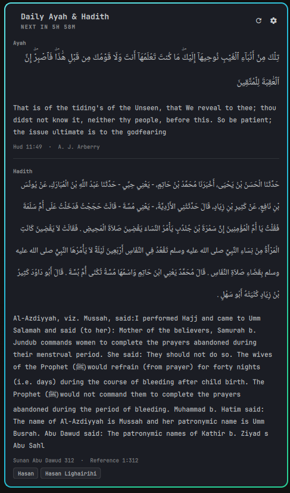

# Daily Ayah & Hadith

An Omarchy 4 (Quattro) shell plugin: a rotating Qur'an ayah and hadith in the bar,
with a panel for the full text, translation, reference and grading.

- **98 languages** for the Qur'an (492 editions) and **9** for hadith (10 collections)
- **Grade filter** — sahih, sahih or hasan, da'if, or anything, with a preferred grader
- **Rotates on a timer you set**, and shows the same passage until that timer is up,
  across shell restarts and suspends
- **Works offline** once the editions you chose have been cached
- **Its own UI language**, separate from the language of the translations



## Install

```bash
omarchy plugin add https://github.com/kusumaindraputra/omarchy-daily-deen.git --enable
```

Plugins land disabled so you can read the code first; `--enable` skips that. It puts
the widget on the right of the bar — move it with `omarchy bar move`.

Everything is configured from the panel: click the pill, then the cog.

Requires `curl` and `jq`. For Arabic, install `noto-fonts` and `noto-fonts-extra`
(`Noto Naskh Arabic`, and `Noto Nastaliq Urdu` if you read Urdu); without them
fontconfig substitutes per glyph and long passages look ragged.

## Remove

```bash
omarchy plugin remove io.github.kusumaindraputra.daily-deen
```

That takes the widget out of the bar and deletes the plugin folder. The downloaded
editions and the current pick live outside it and are left alone, so a reinstall
picks up where you left off. To clear those too:

```bash
rm -rf "${XDG_CACHE_HOME:-$HOME/.cache}/omarchy-daily-deen" \
       "${XDG_STATE_HOME:-$HOME/.local/state}/omarchy-daily-deen"
```

Nothing else on your system is touched. At runtime the plugin writes only to those
two directories, plus its own entry in Omarchy's plugin settings when you change
something in the panel. It never edits your Hyprland configuration.

## Where the text comes from

[`fawazahmed0/quran-api`](https://github.com/fawazahmed0/quran-api) and
[`fawazahmed0/hadith-api`](https://github.com/fawazahmed0/hadith-api) — static JSON on
jsDelivr, no API key, no rate limit. Their language coverage is why they were chosen
over quran.com or sunnah.com, and being static files is why the offline mode is
simply a matter of keeping a copy.

Neither is treated as trustworthy. Edition slugs come out of those catalogs and
end up in both a URL and a cache path, so they are matched against
`^[A-Za-z0-9][A-Za-z0-9._-]*$` and refused otherwise — once when the catalog is
built and again wherever one is used. Every download is capped, by `--max-filesize`
and again by measuring what actually arrived, and a catalog that parses but
carries no editions or the wrong number of surahs is rejected rather than cached.

## How gradings are read

Graders write free text, not an enum: `Sahih`, `Hasan Sahih`, `Sahih Isnaad`,
`Sahih Lighairihi`, `Da'if`, `Mauquf Sahih`, `Sahih Bukhari (1224) Sahih Muslim (570)`.
`bin/grades.jq` normalises all of it into five classes — sahih, hasan, da'if, fabricated,
ungraded — once, when the index is built. Choices worth knowing about:

- **`Hasan Sahih` counts as hasan**, not sahih. Tirmidhi uses the phrase constantly and
  hasan is the conservative reading.
- **Parenthesised cross-references are stripped before anything is matched**, so
  `Sahih Bukhari (1224)` is read as a verdict of sahih rather than as a hadith number.
- **`Munkar` and `Shadh` are da'if**, not fabricated. They are defects, not forgeries.
- **`Mursal`, `Mauquf` and `Maqtu` on their own are ungraded.** They describe a chain,
  they are not a verdict.
- **Sahih al-Bukhari and Sahih Muslim ship no grade strings at all**, because every
  hadith in them is authentic by construction. They are treated as sahih — otherwise a
  sahih filter over Bukhari would return nothing.
- A collection with no gradings anywhere (Nawawi's Forty, the Forty Qudsi) **ignores the
  filter and says so in the panel** rather than showing an empty page.

With a **preferred grader** set, that scholar's verdict decides on its own. With the
field empty, the strictest verdict present wins — which means one da'if among four sahih
makes the hadith da'if. That is deliberate, and it is why `Al-Albani` is the default:
he graded nine of the ten collections, and it matches what most hadith apps show.

`tests/fixtures/grades.tsv` holds every distinct grade string in the corpus with the
class it must map to, reviewed by hand. `tests/grades.test.sh` gates it.

## Layout

```
manifest.json     kinds: service + bar-widget
Service.qml       rotation clock, helper calls, notification, IPC target
BarWidget.qml     the bar pill; per monitor, holds no state
Panel.qml         the popup: content and settings
Model.js          pure logic (node-testable)
Grades.js         grade presentation
I18n.js           nine UI locales
bin/deen-fetch    curl + jq: catalog, sync, index, pick
bin/grades.jq     the grade normaliser
```

Two things drove the shape:

**The service exists so that a three-monitor desk gets one notification, not three.**
A bar surface is created per screen, so anything with a side effect has to live outside
the widget.

**All the I/O is in bash, not QML.** `omarchy-shell` is a single Quickshell process on a
single GUI thread — a `JSON.parse` of a 4.8 MB hadith edition there would freeze the bar,
every panel, the notification daemon and the lock screen for as long as it took. `jq`
does that work in a subprocess and QML only ever sees the ~2 KB result.

**Rotation is a comparison against a stored timestamp**, not a `Timer` whose interval is
the rotation period. A period-length timer restarts from zero when the shell restarts,
and a laptop waking after eight hours would fire it eight times over.

## Cache and state

```
$XDG_CACHE_HOME/omarchy-daily-deen/
  catalog.json          slimmed edition lists for both APIs, plus surah metadata
  quran/<edition>.json  full editions, only the ones you chose
  hadith/<edition>.json
  index/<edition>.json  hadith numbers by grade class
  etag/                 for conditional GETs

$XDG_STATE_HOME/omarchy-daily-deen/
  current.json          the passage on screen, and when it was chosen
  seen.json             recent picks, to avoid immediate repeats in random mode
```

The cache is regenerable and safe to delete. The index is what makes the offline mode
work at all: hadith numbering has gaps — Abu Dawud ends at 5274 but not every number
below it exists — so picking a random number in a range 404s regularly. The index
enumerates only numbers that are actually there, per grade class.

## The CLI

`bin/deen-fetch` is usable on its own, and a keybind that runs it reaches the shell
through the state file:

```bash
bin/deen-fetch catalog                       # refresh the edition lists
bin/deen-fetch sync --hadith ind-abudawud    # download and index
bin/deen-fetch pick --force …                # choose a new passage now
bin/deen-fetch status                        # what is on screen
```

Over IPC:

```bash
omarchy-shell io.github.kusumaindraputra.daily-deen next     # rotate now
omarchy-shell io.github.kusumaindraputra.daily-deen status   # current pick as JSON
omarchy-shell io.github.kusumaindraputra.daily-deen sync     # re-download the chosen editions
omarchy-shell shell toggle io.github.kusumaindraputra.daily-deen   # open the panel
```

A Hyprland keybind, in `~/.config/hypr/bindings.lua`:

```lua
o.bind("SUPER + SHIFT + Q", "Daily ayah", "omarchy-shell shell toggle io.github.kusumaindraputra.daily-deen")
```

## Developing

```bash
node --test "tests/*.test.js"    # Model.js, Grades.js, I18n.js
./tests/grades.test.sh           # the classifier against the real corpus
./tests/pick.test.sh             # rotation and --force, on throwaway fixtures
./tests/inputs.test.sh           # what it refuses from the CDN
omarchy plugin validate .
./bin/dev-sync                   # copy into ~/.config/omarchy/plugins and reload
```

Work in a checkout outside `~/.config/omarchy/plugins` and sync with `dev-sync`:
the PluginRegistry watches that directory with `inotifywait` and reloads **every** plugin
on any write there. Copy rather than symlink — `omarchy plugin validate` rejects a symlink
anywhere in a plugin folder, and that is a deliberate security boundary.

QML errors go to `journalctl --user -t omarchy-shell -f`. `qmllint` cannot resolve
`qs.Ui`/`qs.Commons`, so it is only useful as a syntax check.

Hot reload does not always pick up a fixed compile error — the engine can keep serving
the previous compilation of a URL. When a warning points at a line that no longer says
what the warning claims, `omarchy restart shell`.

## Licence

MIT.
